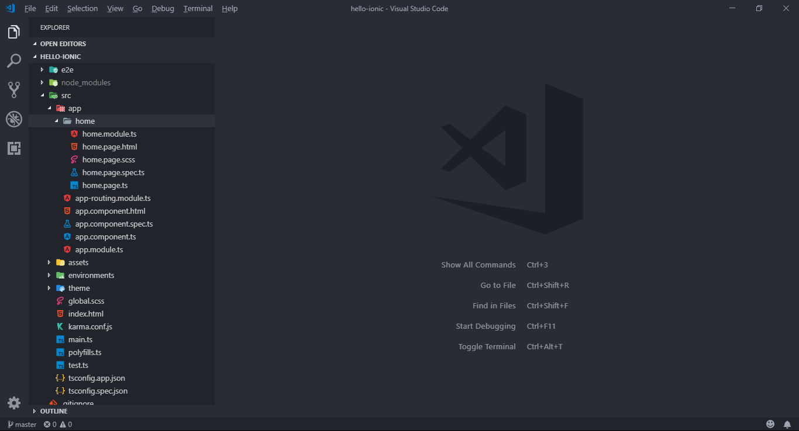

# Hello, Ionic

Para criar uma nova aplicação baseada na plataforma Ionic, o comando ```ionic start``` (do Ionic CLI) deve ser executado:

```
$ ionic start <app-name> <template>
```

*Templates* de aplicações Ionic podem ser utilizados para simplificar a criação de um novo projeto a partir de um modelo

Por padrão, os valores ```blank```, ```tabs``` e ```sidemenu``` podem ser informados como *templates*

A listagem completa pode ser consulta por meio da instrução:

```
$ ionic start --list
```

Consulte a [documentação oficial da instrução ```ionic start```](https://ionicframework.com/docs/cli/commands/start)

## Criação do app 'Hello, Ionic'

1. Crie um diretório ```..\desenvmovel\workspace``` para armazenar os projetos;

2. Via terminal (*prompt* de comandos), navegue até este diretório;

3. Crie uma nova aplicação via Ionic CLI (com template ```blank```);

```
$ ionic start hello-ionic blank
```

> Nesta etapa, também são solicitadas (via terminal) algumas informações para criação do projeto como, por exemplo, (i) instalação do Ionic Appflow (inicialmente, informar ```n``` nesta opção), (ii)

> Além da criação da hierarquia padrão (estrutura do projeto Ionic), também é realizado o download das dependências do projeto que são armazenadas do diretório ```..\hello-ionic\node_modules```

> A estrutura inicial de um projeto Ionic com dependências pode resultar em um diretório de ```400 MB``` a ```500 MB```

4. Abrir o diretório do projeto ```..\desenvmovel\workspace\hello-ionic``` via Visual Studio Code (ou IDE de preferência);



5.
